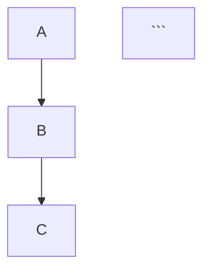
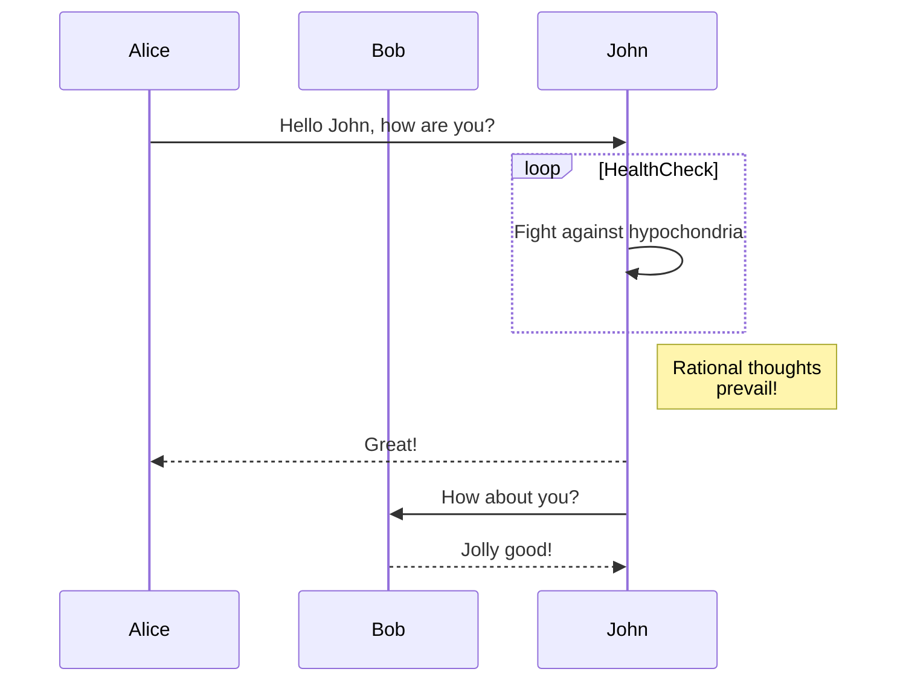
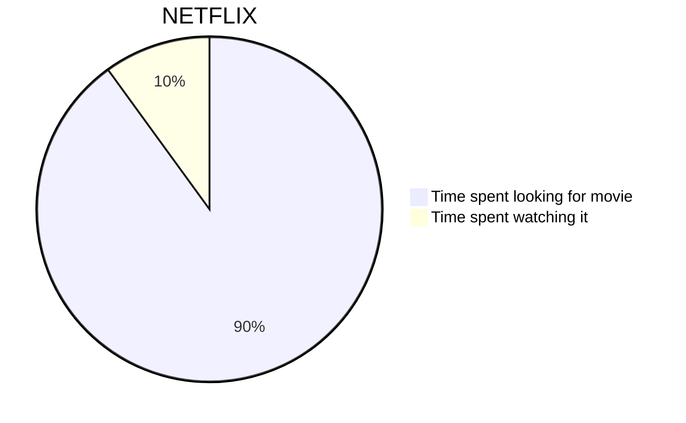
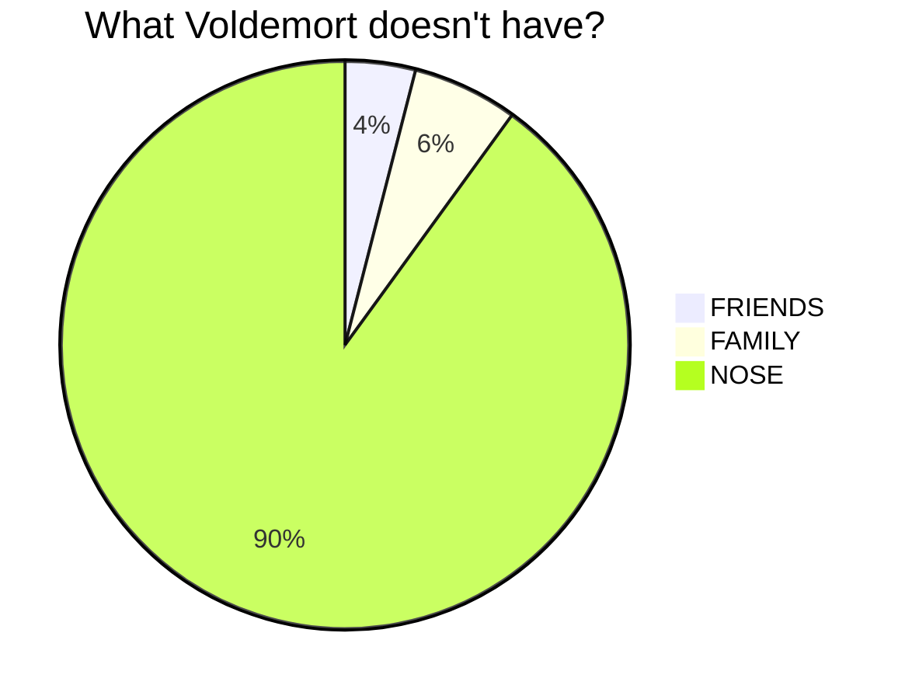
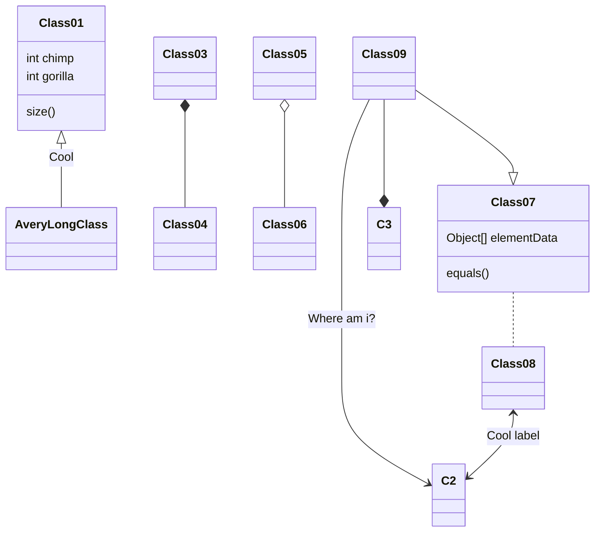

---
# Basic Options
title: Mermaid Diagramming and charting
date: 2025-02-10
categories: [Mermaid, Diagramm, Tutorial, Basics]
tags: [Basic, Mermaid, Data, Analytics, Diagramms, Visualisation, Plotting]

# Additional Options
author: "IronDingo"
pin: true    # pins post to top
math: false   # enables math formatting
mermaid: true # enables mermaid diagrams
image:
  path: "https://avatars.githubusercontent.com/u/57169982?s=200&v=4"
  alt: Mermaid Diagramming and charting tool
--- 


Exploring Mermaid visualisation and math!

### Mermaid

In the Basic Options in the markdown file within the `_posts` folder.
```md
mermaid: true - # Enables Mermaid diagrams for creating flowcharts, like
```
```md

gives:





More examples under:
* [Intro https://mermaid.js.org/intro/](https://mermaid.js.org/intro/)
* [Examples https://mermaid.js.org/syntax/examples.html](https://mermaid.js.org/syntax/examples.html)
